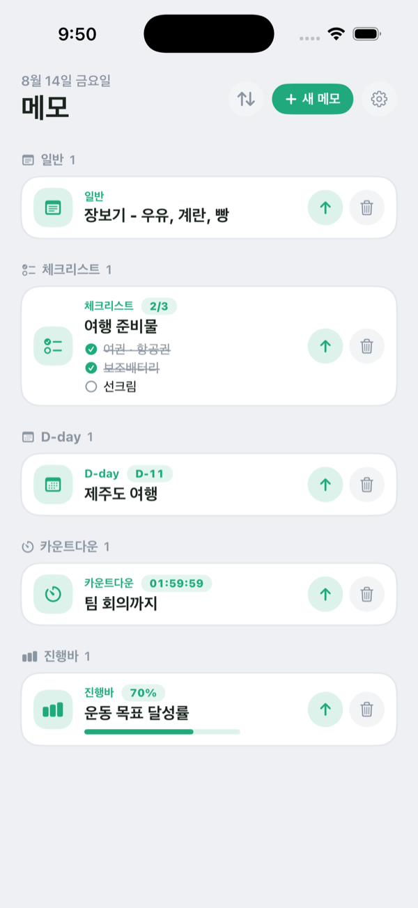
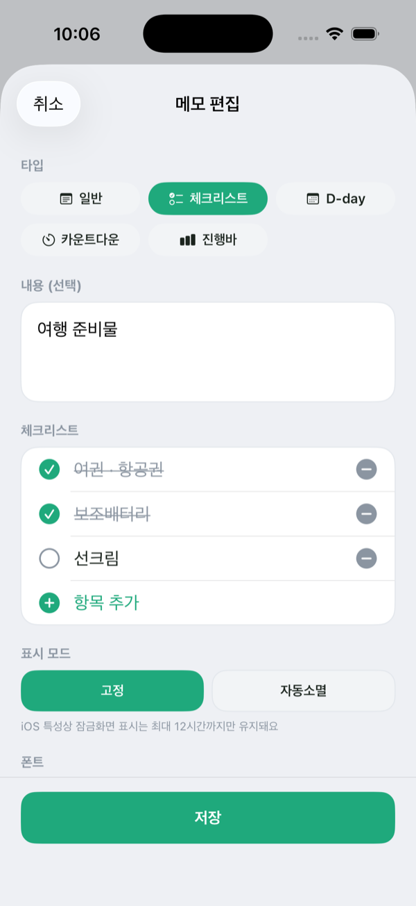
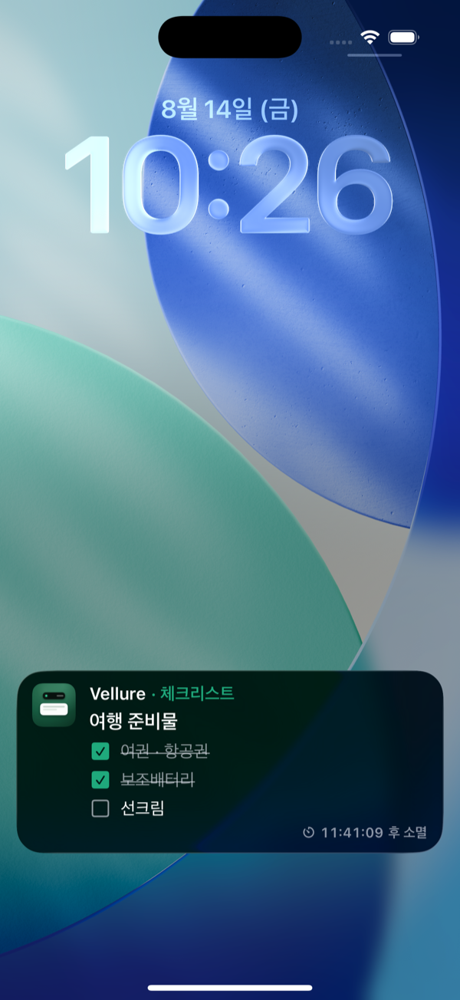
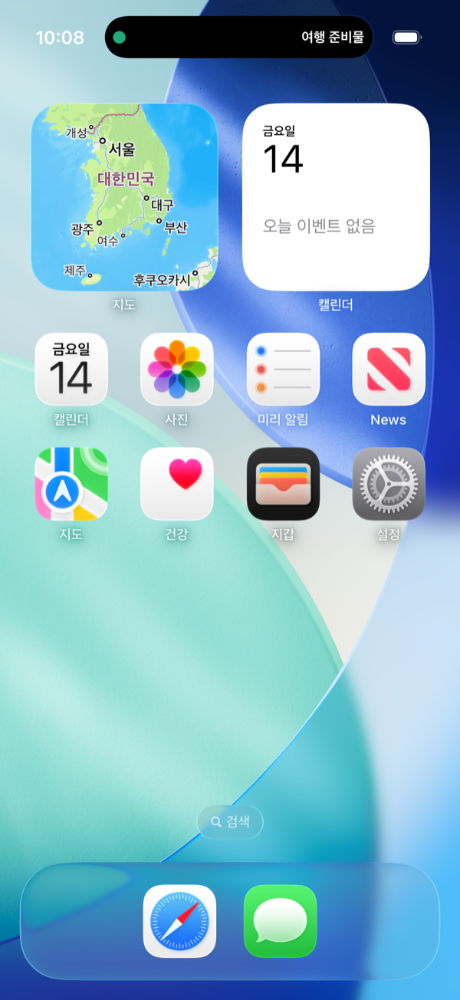
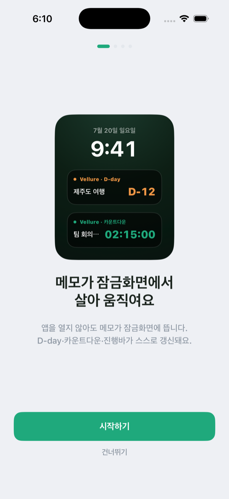

# Vellure

> 메모를 **잠금화면과 다이나믹 아일랜드**에 살아 움직이는 Live Activity로 띄우는 iOS 앱

앱을 열지 않아도 메모가 잠금화면에 떠 있고, D-day·카운트다운·진행바는 스스로 갱신됩니다.
체크리스트는 잠금화면에서 바로 체크할 수 있고, Siri 한마디로 메모를 올릴 수 있어요.
모든 데이터는 회원가입 없이 기기에만 저장되는 **순수 무료** 앱입니다.

<p>
  
  
  
  
  
</p>

## 스크린샷

<p align="center">
  
  &nbsp;
  
  &nbsp;
  
  &nbsp;
  
  &nbsp;
  
</p>

- **홈 (메모 목록)** — 일반 · 체크리스트 · D-day · 카운트다운 · 진행바 5가지 타입을 한눈에
- **메모 편집** — 타입 선택 · 체크리스트 · 표시 모드 · 폰트/색상 구성
- **잠금화면 Live Activity** — 잠금화면에서 체크리스트를 바로 토글, 소멸까지 남은 시간 표시
- **다이나믹 아일랜드** — 홈 화면에서도 살아 있는 Live Activity
- **온보딩** — 앱을 열지 않아도 잠금화면에 뜨는 메모, 권한 허용, Siri 활용법을 4단계로 안내

## 주요 기능

- **잠금화면 Live Activity** — 앱을 열지 않아도 메모가 잠금화면에 표시되고, 다이나믹 아일랜드에서도 확인
- **5가지 메모 타입** — 일반 · 체크리스트 · D-day · 카운트다운 · 진행바
- **인터랙티브 위젯** — 잠금화면에서 체크리스트 항목을 바로 토글하고 진행률을 조절
- **표시 모드** — `고정`으로 계속 띄우거나, `자동소멸` 트리거(목표 시각 도달 · N시간 경과 · 체크 완료 · 100% 도달)로 스스로 내려가게 설정
- **Siri · 단축어** — "벨루어 메모 우유 사기"처럼 말하면 앱을 열지 않고 저장·게시. 위치/시간 기반 자동화도 지원
- **커스터마이징** — 폰트(기본 · 라운드 · 세리프 · 모노)와 색상 태그 선택
- **프라이버시 우선** — 회원가입·서버 전송 없음. 모든 데이터는 기기에만 저장(SwiftData)
- **다국어 지원** — 한국어 · 영어 · 일본어 · 중국어(간체)

### 메모 타입

| 타입 | 설명 | 자동소멸 트리거 |
|------|------|------|
| `plain` 일반 | 텍스트 메모 | N시간 경과 |
| `checklist` 체크리스트 | 잠금화면에서 토글 가능한 할 일 목록 | N시간 경과 · 체크 완료 |
| `dday` D-day | 목표일까지 남은 일수 | 목표 시각 도달 · N시간 경과 |
| `countdown` 카운트다운 | 목표 시각까지 실시간 카운트다운 | 목표 시각 도달 · N시간 경과 |
| `progress` 진행바 | 잠금화면에서 조절 가능한 진행률 | N시간 경과 · 100% 도달 |

> iOS 정책상 Live Activity는 게시 후 최대 12시간 동안 표시된 뒤 시스템이 자동 종료합니다.

## 기술 스택

- **UI**: SwiftUI
- **아키텍처**: MVVM (모듈화된 레이어 구조)
- **데이터**: SwiftData (로컬 전용)
- **Live Activity**: ActivityKit / WidgetKit + App Intents
- **음성/자동화**: SiriKit · App Intents (Shortcuts)
- **최소 지원**: iOS 26.4
- **언어**: Swift 5.0
- **프로젝트 생성**: Tuist (`Project.swift`)
- **린트**: SwiftLint
- **CI/CD**: GitHub Actions, Fastlane

## 프로젝트 구조

의존 방향: `App → Presentation → Data → Core` (역방향 참조 금지)

```
Vellure/
├── Vellure/                  # App 타깃 (Entry Point, Intents, Resources)
├── VellureCore/              # 모델·유틸리티 (Memo, MemoAttributes, Theme 등)
├── VellureData/              # 저장소·서비스 (MemoRepository, LiveActivityService)
├── VellurePresentation/      # ViewModel·SwiftUI 뷰
├── VellureLiveActivity/      # 위젯 익스텐션 (잠금화면·다이나믹 아일랜드 UI)
├── VellureTests/             # 단위 테스트
└── VellureUITests/           # UI 테스트
```

## 시작하기

### 요구사항

- Xcode 26.4.1+
- [Tuist](https://tuist.io) (프로젝트 생성)
- SwiftLint (`brew install swiftlint`)

### 설치

```bash
git clone https://github.com/shinseunguk/Vellure.git
cd Vellure
tuist generate        # Project.swift로부터 Xcode 프로젝트 생성
open Vellure.xcworkspace
```

### Fastlane

```bash
bundle install
bundle exec fastlane lint    # SwiftLint 실행
bundle exec fastlane build   # 개발 빌드
bundle exec fastlane test    # 테스트 실행
bundle exec fastlane beta    # TestFlight 배포
bundle exec fastlane release # App Store 배포
```

## 브랜치 전략

| 브랜치 | 용도 |
|--------|------|
| `main` | 프로덕션 릴리즈 |
| `develop` | 개발 통합 |
| `feature/*` | 기능 개발 |
| `bugfix/*` | 버그 수정 |
| `hotfix/*` | 긴급 수정 |

## 커밋 컨벤션

Conventional Commits 스타일을 따르며, 커밋 메시지는 한글로 작성합니다.

```
feat: 새로운 기능 추가
fix: 버그 수정
refactor: 리팩토링
style: 코드 스타일 변경
docs: 문서 수정
test: 테스트 추가/수정
chore: 빌드, 설정 등 기타 작업
```
